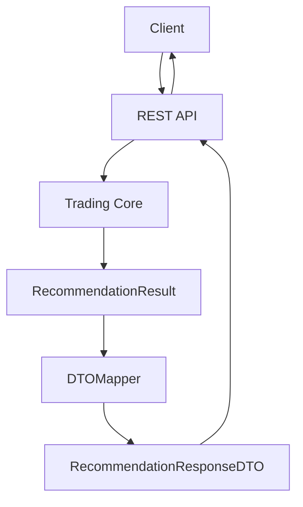

# Flow Diagram - Application Contracts DTO

```mermaid
flowchart TD
    A[Client] --> B[REST API]
    B --> C[Trading Core]
    C --> D[RecommendationResult]
    D --> E[DTOMapper]
    E --> F[RecommendationResponseDTO]
    F --> B
    B --> A
```

## Regle Principale

Le client ne recoit jamais directement les objets internes du Trading Core.

L'API REST expose uniquement les DTO.
