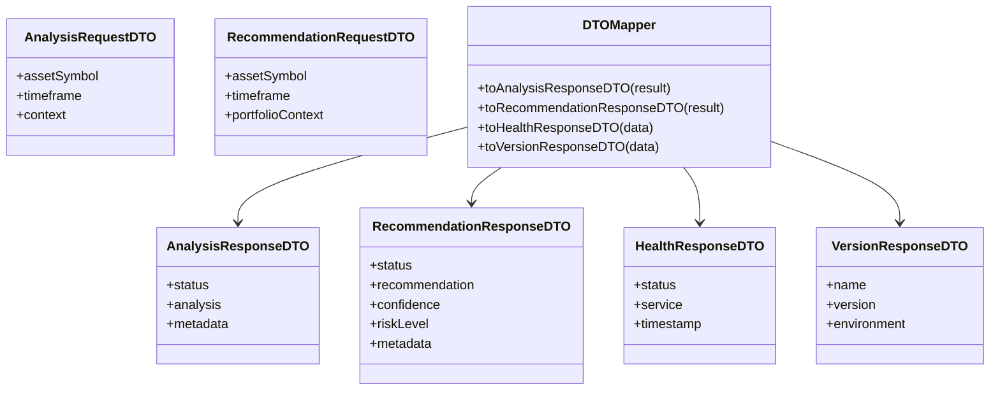

# UML - Application Contracts DTO

```mermaid
classDiagram
  class AnalysisRequestDTO {
    +assetSymbol
    +timeframe
    +context
  }

  class AnalysisResponseDTO {
    +status
    +analysis
    +metadata
  }

  class RecommendationRequestDTO {
    +assetSymbol
    +timeframe
    +portfolioContext
  }

  class RecommendationResponseDTO {
    +status
    +recommendation
    +confidence
    +riskLevel
    +metadata
  }

  class HealthResponseDTO {
    +status
    +service
    +timestamp
  }

  class VersionResponseDTO {
    +name
    +version
    +environment
  }

  class DTOMapper {
    +toAnalysisResponseDTO(result)
    +toRecommendationResponseDTO(result)
    +toHealthResponseDTO(data)
    +toVersionResponseDTO(data)
  }

  DTOMapper --> AnalysisResponseDTO
  DTOMapper --> RecommendationResponseDTO
  DTOMapper --> HealthResponseDTO
  DTOMapper --> VersionResponseDTO
```
