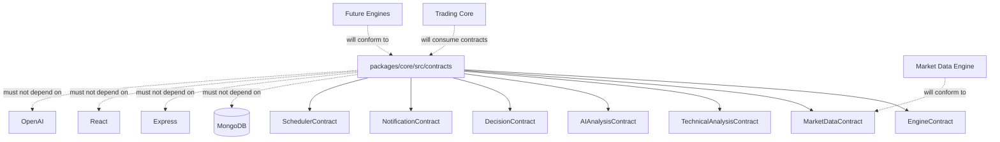

# Dependency Diagram - Engine Contracts

```mermaid
flowchart TD
    Contracts[packages/core/src/contracts]

    EngineContract[EngineContract]
    MarketDataContract[MarketDataContract]
    TechnicalAnalysisContract[TechnicalAnalysisContract]
    AIAnalysisContract[AIAnalysisContract]
    DecisionContract[DecisionContract]
    NotificationContract[NotificationContract]
    SchedulerContract[SchedulerContract]

    Contracts --> EngineContract
    Contracts --> MarketDataContract
    Contracts --> TechnicalAnalysisContract
    Contracts --> AIAnalysisContract
    Contracts --> DecisionContract
    Contracts --> NotificationContract
    Contracts --> SchedulerContract

    MarketDataEngine[Market Data Engine]
    TradingCore[Trading Core]
    FutureEngines[Future Engines]

    MarketDataEngine -. will conform to .-> MarketDataContract
    TradingCore -. will consume contracts .-> Contracts
    FutureEngines -. will conform to .-> Contracts

    Contracts -. must not depend on .-> MongoDB[(MongoDB)]
    Contracts -. must not depend on .-> Express[Express]
    Contracts -. must not depend on .-> React[React]
    Contracts -. must not depend on .-> OpenAI[OpenAI]
```
