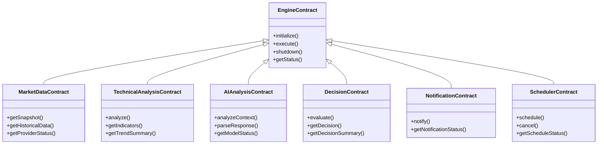

# UML - Engine Contracts

```mermaid
classDiagram
    class EngineContract {
      +initialize()
      +execute()
      +shutdown()
      +getStatus()
    }

    class MarketDataContract {
      +getSnapshot()
      +getHistoricalData()
      +getProviderStatus()
    }

    class TechnicalAnalysisContract {
      +analyze()
      +getIndicators()
      +getTrendSummary()
    }

    class AIAnalysisContract {
      +analyzeContext()
      +parseResponse()
      +getModelStatus()
    }

    class DecisionContract {
      +evaluate()
      +getDecision()
      +getDecisionSummary()
    }

    class NotificationContract {
      +notify()
      +getNotificationStatus()
    }

    class SchedulerContract {
      +schedule()
      +cancel()
      +getScheduleStatus()
    }

    EngineContract <|-- MarketDataContract
    EngineContract <|-- TechnicalAnalysisContract
    EngineContract <|-- AIAnalysisContract
    EngineContract <|-- DecisionContract
    EngineContract <|-- NotificationContract
    EngineContract <|-- SchedulerContract
```
