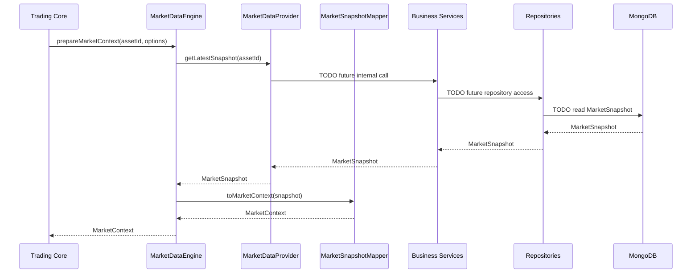

# Sequence Diagram - Market Data Engine

```mermaid
sequenceDiagram
    participant Core as Trading Core
    participant Engine as MarketDataEngine
    participant Provider as MarketDataProvider
    participant Mapper as MarketSnapshotMapper
    participant Services as Business Services
    participant Repo as Repositories
    participant DB as MongoDB

    Core->>Engine: prepareMarketContext(assetId, options)
    Engine->>Provider: getLatestSnapshot(assetId)
    Provider->>Services: TODO future internal call
    Services->>Repo: TODO future repository access
    Repo->>DB: TODO read MarketSnapshot
    DB-->>Repo: MarketSnapshot
    Repo-->>Services: MarketSnapshot
    Services-->>Provider: MarketSnapshot
    Provider-->>Engine: MarketSnapshot
    Engine->>Mapper: toMarketContext(snapshot)
    Mapper-->>Engine: MarketContext
    Engine-->>Core: MarketContext
```
