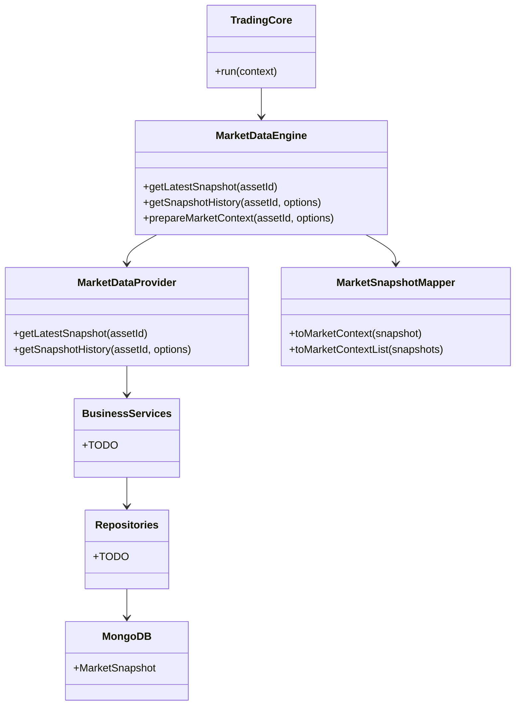

# UML - Market Data Engine

```mermaid
classDiagram
    class TradingCore {
      +run(context)
    }

    class MarketDataEngine {
      +getLatestSnapshot(assetId)
      +getSnapshotHistory(assetId, options)
      +prepareMarketContext(assetId, options)
    }

    class MarketDataProvider {
      +getLatestSnapshot(assetId)
      +getSnapshotHistory(assetId, options)
    }

    class MarketSnapshotMapper {
      +toMarketContext(snapshot)
      +toMarketContextList(snapshots)
    }

    class BusinessServices {
      +TODO
    }

    class Repositories {
      +TODO
    }

    class MongoDB {
      +MarketSnapshot
    }

    TradingCore --> MarketDataEngine
    MarketDataEngine --> MarketDataProvider
    MarketDataEngine --> MarketSnapshotMapper
    MarketDataProvider --> BusinessServices
    BusinessServices --> Repositories
    Repositories --> MongoDB
```
