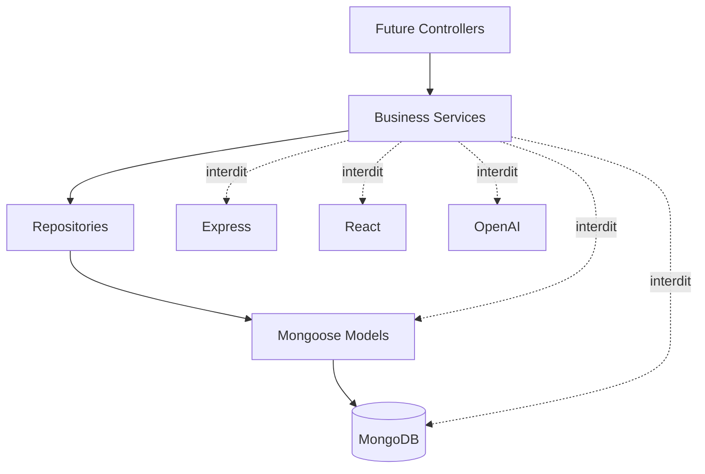

# Services Dependencies Diagram

```mermaid
flowchart TD
    Controller[Future Controllers] --> Service[Business Services]
    Service --> Repository[Repositories]
    Repository --> Model[Mongoose Models]
    Model --> MongoDB[(MongoDB)]

    Service -. interdit .-> Model
    Service -. interdit .-> MongoDB
    Service -. interdit .-> Express
    Service -. interdit .-> React
    Service -. interdit .-> OpenAI
```

## Regle

Les Business Services ne dependent que des repositories.

Les repositories ne dependent jamais des services.
