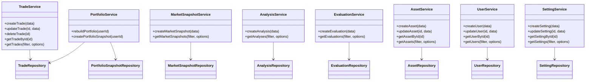

# UML - Business Services

```mermaid
classDiagram
    class TradeService {
      +createTrade(data)
      +updateTrade(id, data)
      +deleteTrade(id)
      +getTradeById(id)
      +getTrades(filter, options)
    }

    class PortfolioService {
      +rebuildPortfolio(userId)
      +createPortfolioSnapshot(userId)
    }

    class MarketSnapshotService {
      +createMarketSnapshot(data)
      +getMarketSnapshots(filter, options)
    }

    class AnalysisService {
      +createAnalysis(data)
      +getAnalyses(filter, options)
    }

    class EvaluationService {
      +createEvaluation(data)
      +getEvaluations(filter, options)
    }

    class AssetService {
      +createAsset(data)
      +updateAsset(id, data)
      +getAssetById(id)
      +getAssets(filter, options)
    }

    class UserService {
      +createUser(data)
      +updateUser(id, data)
      +getUserById(id)
      +getUsers(filter, options)
    }

    class SettingService {
      +createSetting(data)
      +updateSetting(id, data)
      +getSettingById(id)
      +getSettings(filter, options)
    }

    TradeService --> TradeRepository
    PortfolioService --> TradeRepository
    PortfolioService --> PortfolioSnapshotRepository
    MarketSnapshotService --> MarketSnapshotRepository
    AnalysisService --> AnalysisRepository
    EvaluationService --> EvaluationRepository
    AssetService --> AssetRepository
    UserService --> UserRepository
    SettingService --> SettingRepository
```
