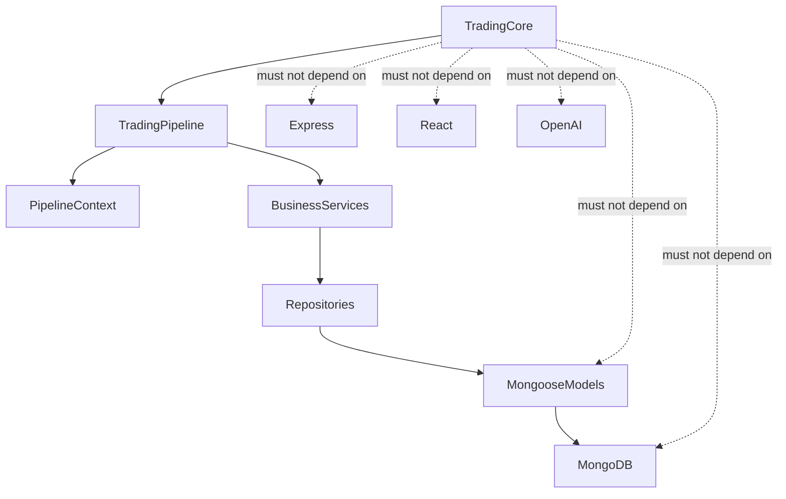

# Dependency Diagram - Trading Core

```mermaid
flowchart TD
    TradingCore --> TradingPipeline
    TradingPipeline --> PipelineContext
    TradingPipeline --> BusinessServices
    BusinessServices --> Repositories
    Repositories --> MongooseModels
    MongooseModels --> MongoDB

    TradingCore -. must not depend on .-> MongoDB
    TradingCore -. must not depend on .-> MongooseModels
    TradingCore -. must not depend on .-> Express
    TradingCore -. must not depend on .-> React
    TradingCore -. must not depend on .-> OpenAI
```
