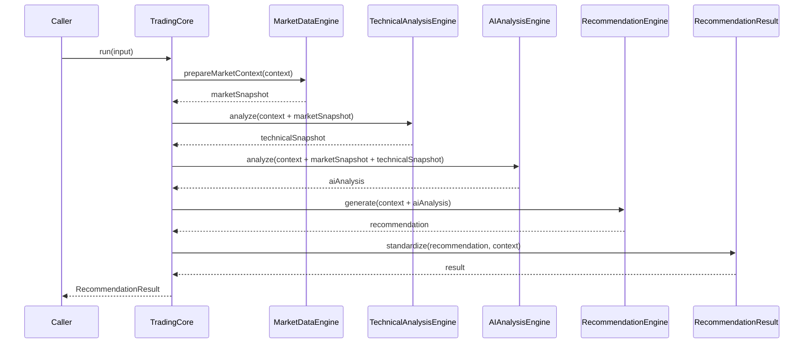

# Sequence Diagram - Trading Integration

```mermaid
sequenceDiagram
    participant Caller
    participant TradingCore
    participant MarketDataEngine
    participant TechnicalAnalysisEngine
    participant AIAnalysisEngine
    participant RecommendationEngine
    participant RecommendationResult

    Caller->>TradingCore: run(input)
    TradingCore->>MarketDataEngine: prepareMarketContext(context)
    MarketDataEngine-->>TradingCore: marketSnapshot

    TradingCore->>TechnicalAnalysisEngine: analyze(context + marketSnapshot)
    TechnicalAnalysisEngine-->>TradingCore: technicalSnapshot

    TradingCore->>AIAnalysisEngine: analyze(context + marketSnapshot + technicalSnapshot)
    AIAnalysisEngine-->>TradingCore: aiAnalysis

    TradingCore->>RecommendationEngine: generate(context + aiAnalysis)
    RecommendationEngine-->>TradingCore: recommendation

    TradingCore->>RecommendationResult: standardize(recommendation, context)
    RecommendationResult-->>TradingCore: result

    TradingCore-->>Caller: RecommendationResult
```
