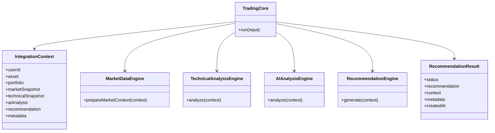

# UML - Final Trading Pipeline

```mermaid
classDiagram
    class TradingCore {
      +run(input)
    }

    class IntegrationContext {
      +userId
      +asset
      +portfolio
      +marketSnapshot
      +technicalSnapshot
      +aiAnalysis
      +recommendation
      +metadata
    }

    class MarketDataEngine {
      +prepareMarketContext(context)
    }

    class TechnicalAnalysisEngine {
      +analyze(context)
    }

    class AIAnalysisEngine {
      +analyze(context)
    }

    class RecommendationEngine {
      +generate(context)
    }

    class RecommendationResult {
      +status
      +recommendation
      +context
      +metadata
      +createdAt
    }

    TradingCore --> IntegrationContext
    TradingCore --> MarketDataEngine
    TradingCore --> TechnicalAnalysisEngine
    TradingCore --> AIAnalysisEngine
    TradingCore --> RecommendationEngine
    TradingCore --> RecommendationResult
```
