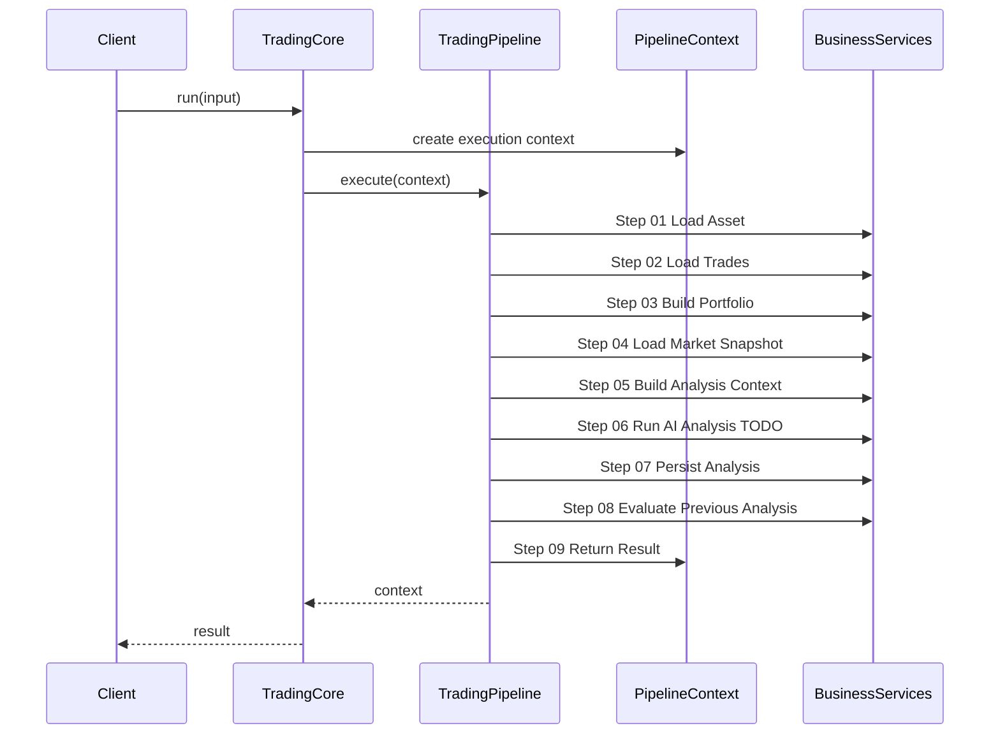

# Sequence Diagram - Trading Core Execution

```mermaid
sequenceDiagram
    participant Client
    participant TradingCore
    participant TradingPipeline
    participant PipelineContext
    participant BusinessServices

    Client->>TradingCore: run(input)
    TradingCore->>PipelineContext: create execution context
    TradingCore->>TradingPipeline: execute(context)

    TradingPipeline->>BusinessServices: Step 01 Load Asset
    TradingPipeline->>BusinessServices: Step 02 Load Trades
    TradingPipeline->>BusinessServices: Step 03 Build Portfolio
    TradingPipeline->>BusinessServices: Step 04 Load Market Snapshot
    TradingPipeline->>BusinessServices: Step 05 Build Analysis Context
    TradingPipeline->>BusinessServices: Step 06 Run AI Analysis TODO
    TradingPipeline->>BusinessServices: Step 07 Persist Analysis
    TradingPipeline->>BusinessServices: Step 08 Evaluate Previous Analysis
    TradingPipeline->>PipelineContext: Step 09 Return Result

    TradingPipeline-->>TradingCore: context
    TradingCore-->>Client: result
```
