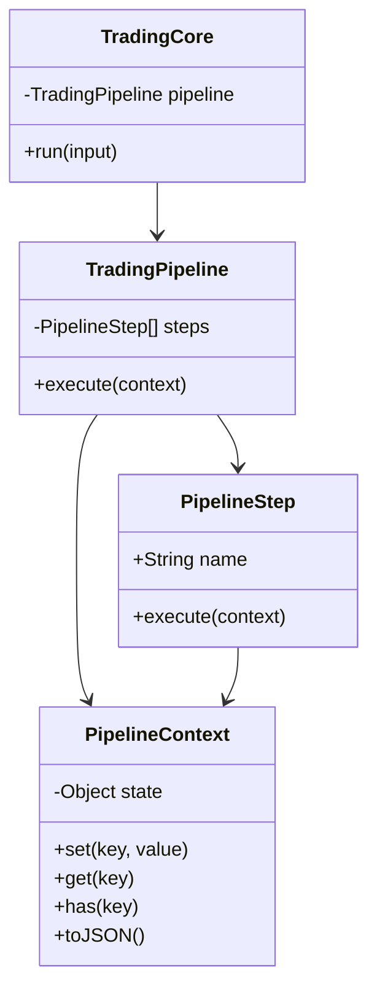

# UML - Trading Pipeline

```mermaid
classDiagram
    class TradingCore {
        -TradingPipeline pipeline
        +run(input)
    }

    class TradingPipeline {
        -PipelineStep[] steps
        +execute(context)
    }

    class PipelineContext {
        -Object state
        +set(key, value)
        +get(key)
        +has(key)
        +toJSON()
    }

    class PipelineStep {
        +String name
        +execute(context)
    }

    TradingCore --> TradingPipeline
    TradingPipeline --> PipelineStep
    TradingPipeline --> PipelineContext
    PipelineStep --> PipelineContext
```
